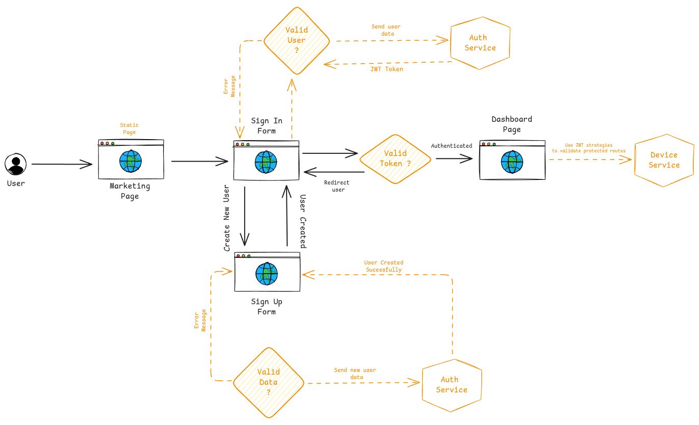

# Smart Device Management

Este é um sistema de gerenciamento de dispositivos.

Nesta plataforma será possível gerenciar dispositivos smarts e monitorar o status de cada dispositivo.

## Tecnologias utilizadas

Foi utilizado como gerenciador do respositório o TurboRepo.

O TurboRepo é uma ferramenta que permite gerenciar múltiplos repositórios e projetos em um único workspace, facilitando a colaboração e o desenvolvimento de projetos.

<a alt="TurboRepo logo" href="https://turborepo.com/docs" target="_blank" rel="noreferrer"></a>

---

Para a aplicação Back end foi utilizado NestJS.

O NestJS é um framework Node, que utiliza o padrão typescript, onde podemos desenvolver utilizando injeções de dependências, tornando
mais simples o desenvolvimento das aplicações.

<a alt="Nest logo" href="https://nestjs.com/" target="_blank" rel="noreferrer"></a>

---

Como banco de dados foi utilizado Postgresql.

O Postgresql é um sistema gerenciador de banco de dados e relacional de código aberto.

<a alt="postgres logo" href="https://www.postgresql.org/" target="_blank" rel="noreferrer"></a>

---

Para o Front end foi utilizado NextJS.

O NextJS é um framework React, uma poderosa ferramenta de desenvolvimento, onde é possível renderizar componentes e realizar o data fetching no lado do servidor
disponibilizando uma melhor performance para aplicação.

<a alt="Next logo" href="https://nextjs.org/" target="_blank" rel="noreferrer"></a>

---

Para os componentes foi utilizado a biblioteca Shadcn UI.

Uma biblioteca de componentes completa, versátil e de fácil implementação.

<a alt="Shadcn UI logo" href="https://ui.shadcn.com/" target="_blank" rel="noreferrer"></a>

---

## Instalação do Repositório

Para instalar as dependências no repositório:

- Utilizando npm:

  `npm i`

Para rodar o projeto localmente, basta rodar o comando para iniciar a imagem do banco de dados e depois rodar o comando para iniciar o projeto.

`docker compose up postgres -d`

`npm run dev`

Para rodar as migrations (este passo é necessário somente para a aplicação local), execute o comando dentro da pasta `apps/smart-management-api`:

`cd apps/smart-management-api`

`npm run typeorm migration:run`

Para rodar o projeto em container, com um simples comando é possivel executar o projeto em container.

`docker compose up -d`

Para parar o projeto em container, basta executar o comando:

`docker compose down`

As migrations serão executadas automaticamente quando o container for iniciado.

Serão necessarias as variáveis de ambiente do projeto, é possivel encontrá-las no arquivo `.env.example` dentro de cada aplicação.
se necessário gerar uma nova chave de encriptação, execute o comando:

`openssl rand -base64 32`

e cole a chave gerada no arquivo `.env` dentro de cada aplicação.

### Arquitetura Macro


### Auth basic flow


### OBSERVAÇÃO

A aplicação quando executada em container está com alguns bugs, para testar corretamente utilize por enquanto a aplicação local.

### Rotas

#### Base Url

local:

- http://localhost:8000/device-service
  container:
- http://smart-management-api:8000/devices-service

#### Auth

- `POST /auth/signin`
  Request:

  ```
  {
      "email": "example@teste.com",
      "password": "123456"
  }
  ```

  Response:

  ```
  {
    "id": "08d993b4-0671-448c-ab45-b52fcfa1c741",
    "name": "Example",
    "accessToken": "accessToken",
    "refreshToken": "refreshToken"
  }
  ```

- `POST /auth/signup`
  Request:
  ```
  {
      "email": "example@teste.com",
      "password": "123456"
  }
  ```
  Response:
  ```
  {
    "id": "id",
    "createdAt": "createdAt",
    "updatedAt": "updatedAt",
    "deletedAt": null,
    "name": "name",
    "email": "email",
    "password": "password",
    "hashedRefreshToken": null
  }
  ```
- `POST /auth/signout`
  Request:
  ```
  {
    "userId": "id"
  }
  ```
- `POST /auth/refresh`

#### Devices

- `POST /devices/register`
  Request:
  `     {
    "name": "Living Room Thermostat",
    "type": "thermostat",
    "status": "online",
    "isActive": true,
    "battery": 85,
    "power": 4,
    "temperature": 22
}
    `
  Response:
  `     {
	"message": "Device registered successfully",
	"data": {
		"id": "id",
		"name": "name",
		"type": "type",
		"status": "status",
		"isActive": true,
		"createdAt": "createdAt",
		"updatedAt": "updatedAt",
		"battery": 85,
		"power": 4,
		"temperature": 22
	}
}
    `
- `GET /devices`
  Params:
  ```
  {
      "take": 10,
      "skip": 0,
      "order": "DESC"
  }
  ```
  Response:
  ```
  {
  	"metadata": {
  	"take": 10,
  	"skip": 0,
  	"order": "DESC",
  	"count": 5
  },
  "data": [
  	{
  		"id": "id",
  		"createdAt": "createdAt",
  		"updatedAt": "updatedAt",
  		"deletedAt": null,
  		"name": "name",
  		"type": "type",
  		"status": "status",
  		"isActive": true,
  		"battery": 85,
  		"power": 4,
  		"temperature": 22
  	}]
  }
  ```
- `GET /devices/:id`
  Response:
  ```
  {
    "id": "id",
    "createdAt": "createdAt",
    "updatedAt": "updatedAt",
    "deletedAt": null,
    "name": "name",
    "type": "type",
    "status": "status",
    "isActive": true,
    "battery": 85,
    "power": 4,
    "temperature": 22
  }
  ```
- `PATCH /devices/:id`
  Request:
  ```
  {
      "id": "id",
      "name": "name",
      "type": "type",
      "status": "status",
      "isActive": true,
      "battery": 85,
      "power": 4,
      "temperature": 22
  }
  ```
  Response:
  ```
  {
    "id": "id",
    "createdAt": "createdAt",
    "updatedAt": "updatedAt",
    "deletedAt": null,
    "name": "name",
    "type": "type",
    "status": "status",
    "isActive": true,
    "battery": 85,
    "power": 4,
    "temperature": 22
  }
  ```

#### Users

- `POST /users`

## Web application

### Base Url

local:

- http://localhost:3000/
  container:
- http://smart-management-web:3000

### Pages

#### Unprotected

Marketing page

- `{{base_url}}/`

#### Authentication

Sign in

- `{{base_url}}/signin/`
  Sign up
- `{{base_url}}/signup/`

#### Protected

Dashboard

- `{{base_url}}/dashboard/`

### Basic User Flow



### Respostas do Teste:

1. Arquitetura Geral:

   Como você implantaria esta aplicação (backend, frontend,
   PostgreSQL) na AWS para garantir alta disponibilidade? Descreva os
   serviços que usaria e como eles se conectam.

   - Backend: Usaria o AWS Elastic Beanstalk para gerenciar a aplicação Node.js, pois ele facilita a implantação, gerenciamento e escalabilidade automática.
   - Frontend: O AWS Amplify seria uma boa escolha para hospedar o frontend React.js, oferecendo integração contínua e entrega (CI/CD).
   - Banco de Dados: Utilizaria o Amazon RDS para PostgreSQL, que é um serviço gerenciado que oferece alta disponibilidade com Multi-AZ deployments.
   - Conexões: O Elastic Beanstalk e o Amplify podem se conectar ao RDS através de uma VPC, garantindo segurança e baixa latência.

2. Banco de Dados:

   Para o PostgreSQL, você algum serviço gerenciado AWS? Por quê?
   Como configuraria réplicas e backups para garantir disponibilidade
   e recuperação de desastres?

   - Serviço Gerenciado: Sim, usaria o Amazon RDS para PostgreSQL, pois ele oferece backups automáticos, snapshots, e failover automático.
   - Réplicas e Backups: Configuraria réplicas de leitura para balancear a carga de leitura e usaria snapshots automáticos para backups regulares.

3. Backend:

   Qual serviço AWS você escolheria para hospedar o backend
   Node.js? Justifique considerando escalabilidade e manutenção.

   - Serviço AWS: AWS Elastic Beanstalk, pois ele gerencia automaticamente a capacidade de computação, balanceamento de carga, escalabilidade e monitoramento.

4. Frontend:

   Para o frontend React.js, como você o disponibilizaria na AWS? Por
   quê?

   - Disponibilização: Usaria o AWS Amplify, que é otimizado para aplicações React.js e oferece hospedagem estática com integração CI/CD.

5. Escalabilidade:

   Como garantiria que o backend escala automaticamente com
   aumento de tráfego (ex.: mais dispositivos IoT conectados)? Que
   ferramentas ou serviços AWS usaria?

   - Ferramentas/Serviços: Utilizaria o Auto Scaling do Elastic Beanstalk para ajustar automaticamente a capacidade de instâncias EC2 com base na demanda de tráfego.

6. Segurança:

   Quais práticas e serviços AWS você adotaria para proteger a
   aplicação (ex.: WAF, IAM, Secrets Manager, VPC)? Como gerenciaria
   o JWT na nuvem?

   - Práticas e Serviços: Implementaria o AWS WAF para proteger contra ameaças web, IAM para gerenciar permissões, Secrets Manager para gerenciar credenciais e VPC para isolar a rede.
   - Gerenciamento de JWT: Armazenaria os tokens JWT em um serviço seguro como o AWS Secrets Manager e usaria políticas de expiração e renovação.

7. Monitoramento e Manutenção:

   Como monitoraria a saúde da aplicação (ex.: erros, latência, uso de
   CPU)? Que serviços AWS usaria?
   Como lidaria com atualizações do backend sem tempo de
   inatividade?

   - Monitoramento: Usaria o Amazon CloudWatch para monitorar métricas de desempenho, como erros, latência e uso de CPU.
   - Atualizações sem Downtime: Implementaria o Elastic Beanstalk com implantações de rotação, que permitem atualizações sem tempo de inatividade.

8. Custo x Performance:

   Que estratégias adotaria para otimizar custos na AWS sem
   comprometer a performance?

   - Estratégias: Utilizaria instâncias reservadas ou spot instances para reduzir custos, configuraria o Auto Scaling para otimizar o uso de recursos e usaria o AWS Cost Explorer para monitorar e otimizar gastos.

## Observações

Falha ao rodar a migration: O comando no readme não especifica o databaseSource

Falha ao bater nas apis: As rotas no readme não incluem o path completo, com o "devices-service"
